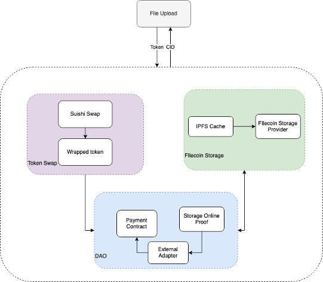

# Multi Chain Payment Guide
[](https://www.filswan.com/)
[](https://discord.com/invite/KKGhy8ZqzK)
[](https://github.com/RichardLitt/standard-readme)

- Join us on our [public Slack channel](https://www.filswan.com/) for news, discussions, and status updates.
- [Check out our medium](https://filswan.medium.com) for the latest posts and announcements.

## Table of Contents
- [Functions](#Functions)
- [System Design](#System-Design)
- [Modules](#Modules)
- [Prerequisites](#Prerequisites)
- [Installation](#Installation)
- [After Installation](#After-Installation)
- [Configuration](#Configuration)
- [Payment Process](#Payment-Process)
- [Database Table Introduction](#Database-Table-Introduction)
- [Pay for Filecoin by Polygon](https://www.youtube.com/watch?v=c4Dvidz3plU)
- [License](#License)

## Functions
- Make payment from multi chain for filecoin storage
- Backup user's file to filecoin network
- Supports payment with tokens such as USDC on polygon
- Currently, USDC is supported for payment.

## System Design



## Modules
* [Token Swap](#Token-Swap)
* [Payment Module](#Payment-Module)
* [Swan Client API](https://github.com/filswan/go-swan-client)
* [DAO Signature](#DAO-Signature)
* [Data DAO](https://github.com/filswan/flink)
* [IPFS](https://docs.ipfs.io/)
* [Filecoin Storage](https://lotus.filecoin.io/docs/set-up/install/)

### Token Swap
1. Users pay USDC or other tokens, which are called user tokens, when uploading a file.
2. MCP uses FIL, which is called wrapped token, to pay when store data to filecoin network.
3. User tokens should be changed to wrapped token by this module and this step is called token exchange(swap).
4. Token exchange(swap) is done through Sushi Swap which is a DEX.

### Payment Module
1. After a file is uploaded, the money to be paid is estimated based on the 
   1. the average price of all the miners on the entire network.
   2. file size
   3. store copy number
   4. duration
2. Then the estimated amount of money will be locked to the payment contract address, see [Configuration](#Configuration)
3. In unlock step, the amount pay to filcoin network by swan platform fil wallet, will be transfered to mcp payment receiver address, see [Configuration](#Configuration)
4. In refund step, the overpayment part that is locked will be returned to user wallet

### DAO Signature
- If DAO detects that the file uploaded has been chained, it will trigger a signature operation

## Prerequisites
- OS: Ubuntu 20.04 LTS
- Mysql5.5+
- [Lotus Node](#Lotus-Node)
- [IPFS Client](https://docs.ipfs.io/install/)

### Lotus Node
- Lotus node is used for making car files and sending offline deals
- Install lotus node or louts lite node in the same machine as MCP
- Lotus full node is too heavy compared with lotus lite node, so lotus lite node is preferred
- Lotus lite node depends on a lotus node, so ensure that a lotus node exists somewhere when using lotus lite node
#### Option:one: [install a lotus full node](https://lotus.filecoin.io/docs/set-up/install/)
#### Option:two: [install a lotus lite node](https://lotus.filecoin.io/docs/set-up/lotus-lite/#amd-and-intel-based-computers)

## Installation
### Option:one:  **Prebuilt package**: See [release assets](https://github.com/filswan/multi-chain-payment/releases)
```shell
wget https://github.com/filswan/multi-chain-payment/releases/tag/v1.0.1/install.sh
./install.sh
```

### Option:two:  Source Code
:bell:**go 1.16+** is required
```shell
git clone https://github.com/filswan/multi-chain-payment.git
cd multi-chain-payment
git checkout <release_branch>
./build_from_source.sh
```

## After Installation
- Before executing, you should check your configuration in `~/.swan/mcp/config.toml` to ensure it is right.
```shell
vi ~/.swan/mcp/config.toml
```
- Before executing, you should check your enviornment variable in `~/.swan/mcp/.env` to ensure it is right.
```shell
vi ~/.swan/mcp/.env
```
- After set your config and env variable in the related files, you can run `multi-chain-payment` in `./build` directory
```shell
./build/multi-chain-payment
```
### Note
- Logs are in directory `./logs`
- You can add `nohup` before `./multi-chain-payment` to ignore the HUP (hangup) signal and therefore avoid stop when you log out.
- You can add `>> mcp.log` in the command to let all the logs output to `mcp.log`.
- You can add `&` at the end of the command to let the program run in background.
- Such as:
```shell
nohup ./multi-chain-payment-0.2.1-rc1-unix >> mcp.log &   #After installation from Option 1
nohup ./build/multi-chain-payment >> ./build/mcp.log &    #After installation from Option 2
```

## Configuration

### config.toml
- **port**: Web api port
- **release**: When work in release mode: set this to true, otherwise to false and enviornment variable GIN_MODE not to release
- **swan_platform_fil_wallet**: The wallet address used to pay on the filecoin network
- **filink_url**: Deals data can be searched from here
#### [lotus]
- **client_api_url**:  Url of lotus client web api, such as: `http://[ip]:[port]/rpc/v0`, generally the `[port]` is `1234`. See [Lotus API](https://docs.filecoin.io/reference/lotus-api/#features)
- **client_access_token**:  Access token of lotus client web api. It should have admin access right. You can get it from your lotus node machine using command `lotus auth create-token --perm admin`. See [Obtaining Tokens](https://docs.filecoin.io/build/lotus/api-tokens/#obtaining-tokens)
#### [ipfs_server]
- **download_url_prefix**: Ipfs server url prefix, such as: `http://[ip]:[port]`. Store car files for downloading by storage provider. Car file url will be `[download_url_prefix]/ipfs/[file_hash]`
- **upload_url_prefix**: Ipfs server url for uploading files, such as `http://[ip]:[port]`
#### [swan_task]
- **dir_deal**: Output directory for saving generated Car files and CSVs
- **verified_deal**: [true/false] Whether deals in this task are going to be sent as verified
- **fast_retrieval**: [true/false] Indicates that data should be available for fast retrieval
- **start_epoch_hours**: start_epoch for deals in hours from current time
- **expired_days**: expected completion days for storage provider sealing data
- **max_price**: Max price willing to pay per GiB/epoch for offline deal
- **generate_md5**: [true/false] Whether to generate md5 for each car file, note: this is a resource consuming action
#### [polygon]
- **rpc_url**: your polygon network rpc url
- **payment_contract_address**:  swan payment gateway address on polygon to lock money
- **sushi_dex_address**:  sushi address on polygon
- **usdc_wFil_pool_contract**:  address to get exchange rate between uscs and wFil from sushi on polygon
- **dao_contract_address**:  swan dao address on polygon, to receive dao signatures
- **mcp_payment_receiver_address**:  mcp wallet address to receive money from unlock operation
- **gas_limit**: gas limit for transaction
- **unlock_interval_minute**: unlock interval in minutes between 2 unlock operations, in cannot be less than 1

### .env
- **privateKeyOnPolygon**: private key of the wallet used to execute contract methods on the polygon network and pay for gas

## Payment Process

1. Users upload a file they want to backup to filecoin network
2. User pay currencies we support to send tokens to our payment contract address, see [Configuration](#Configuration)
3. MCP writes the transaction info to our system
4. MCP scan those source files uploaded and paid but not yet created to car files, and then do the following steps:
   1. compute the max price for each source file, based on the source file size, token paid, and exchange rate betwee USDC and wFil
   2. if the scanned source file size sum is more than 1GB or the earliest source file to be merged to car file is more 1 day ago, then MCP will do the following steps by calling Swan Client API, see [Swan Client](https://github.com/filswan/go-swan-client)
      1. create car files, use the minimum max price among the source files to be merged as the max price for the whole car file
      2. upload car files
      3. create task on swan platform
5. Market Matcher allocate miners for the car file created in last step
6. MCP send deals by calling Swan Client API, see [Swan Client](https://github.com/filswan/go-swan-client)
7. MCP Scan Scheduler module scan the deal info from lotus
8. When DAO organization find the deal succeeds, and then they will sign to agree to unlock the user's payment.
9. After more than half of the dao agree and after 1 minute later of the last DAO signature, MCP will unlock the user's payment, release the moeny spent on send deal to mcp payment receiver address, see [Swan Client](https://github.com/filswan/go-swan-client)
10. After all deals of a car file are unlocked, MCP refund the remaining money to user wallet address used when pay in step 2.

## Database Table Introduction
- You can get db table ddl sql script in `[mcp-source-file-path]/script/dbschema.sql`
- Two tables should be initialized before it can be used

### system_config_param
|column                 |description       |
|param_key              |param_value       |
|-----------------------|------------------|
|SWAN_PAYMENT_CONTRACT_ADDRESS     |swan payment gateway contract address                     |
|LOCK_TIME                         |time that user's token will be locked time                |
|RECIPIENT                         |admin wallet address, used to receive tokens paid by users|
|PAY_GAS_LIMIT                     |max gas limit                                             |
|USDC_ADDRESS                      |usdc address                                              |

### dao_info
### system_config_param
|column                 |description       |
|-----------------------|------------------|
|ID                     |primary key of table   |
|DAO_NAME               |dao's name,required    |
|DAO_ADDRESS            |dao's address,required |
|ORDER_INDEX            |dao display order      |
|DESCRIPTION            |description            |
|CREATE_AT              |create time            |

### Run Payment Bridge as system service
Before running the playbook to start payment bridge as a system service, please first change the following line in `$GOPATH/src/payment-bridge/script/run_services/payment_bridge.service` to the actual path of payment bridge executable:
```
ExecStart=/home/filswan/payment-bridge/build/payment-bridge
```
Now we can run Payment Bridge as a system service by executing the following command in shell and entering sudo password when prompt:
```bash
cd $GOPATH/src/payment-bridge/script/run_services
ansible-playbook run_payment_bridge_service.yaml --ask-become-pass -vvv
```

## License

[MIT](https://github.com/filswan/multi-chain-payment/blob/main/LICENSE)
